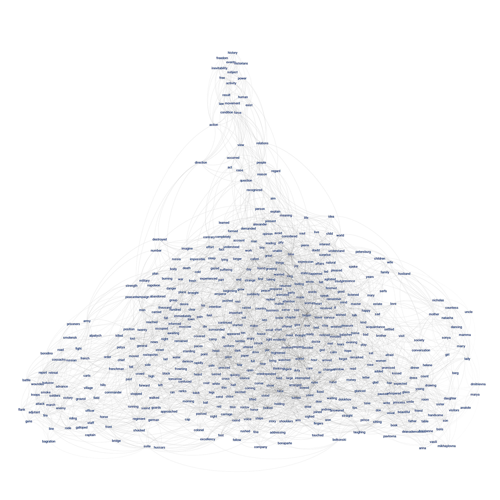
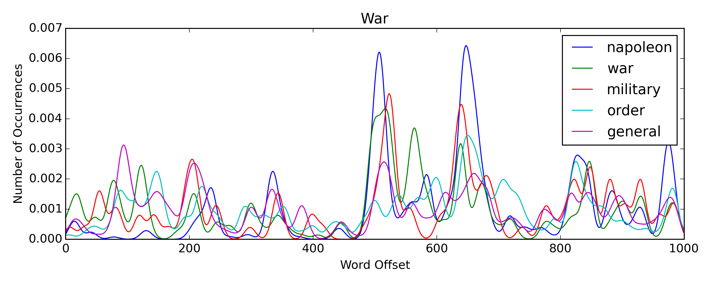

# Textplot

<a href="http://textplot.s3-website-us-west-1.amazonaws.com/#mental-maps/war-and-peace" target="_new">**_War and Peace_**</a> (click to zoom)

<a href="http://textplot.s3-website-us-west-1.amazonaws.com/#mental-maps/war-and-peace" target="_new"></a>

Texplot is a little program that turns a document into a network of terms that are connected to each other depending on the extent to which they appear in the same locations in the text. For each unique term:

1. Get the set of offsets in the document where the term appears.

1. Using [kernel density estimation](http://en.wikipedia.org/wiki/Kernel_density_estimation), compute a probability density function (PDF) that represents the word's distribution across the document. Eg, from _War and Peace_:

  

1. Compute a Bray-Curtis dissimilarity between the term's PDF and the PDFs of all other terms in the document. This measures the extent to which two words appear in the same locations.

1. Sort this list in descending order to get a custom "topic" for the term. Skim off the top X words (usually 10) to get the strongest links. Eg, here's "napoleon" from _War and Peace_:

  ```bash
  [('napoleon', 1.0),
  ('war', 0.65319871313854128),
  ('military', 0.64782349297012154),
  ('men', 0.63958189887106576),
  ('order', 0.63636730075877446),
  ('general', 0.62621616907584432),
  ('russia', 0.62233286026418089),
  ('king', 0.61854160459241103),
  ('single', 0.61630514751638699),
  ('killed', 0.61262010905310182),
  ('peace', 0.60775702746632576),
  ('contrary', 0.60750138486684579),
  ('number', 0.59936009740377516),
  ('accompanied', 0.59748552019874168),
  ('clear', 0.59661288775164523),
  ('force', 0.59657370362505935),
  ('army', 0.59584331507492383),
  ('authority', 0.59523854206807647),
  ('troops', 0.59293965397478188),
  ('russian', 0.59077308177196441)]
  ```

1. Shovel all of these links into a network and export a GML file.

## Generating graphs

The easiest way to build out a graph is to use the `skimmer` function, which wraps up all the intermediate steps of tokenizing the text, computing the term distance matrix, generating the per-word topic lists, etc. First, spin up a virtualenv:

```bash
virtualenv env
. env/bin/activate
pip install -r requirements.txt
```

Then, fire up an IPython terminal and build a network:

```bash
In [1]: from textplot import skimmer

In [2]: g = skimmer('path/to/file.txt')
Indexing terms:
[############################### ] 140000/140185 - 00:00:03
Generating graph:
[################################] 530/530 - 00:00:00

In [3]: g.write_gml('path/to/file.gml')
```

The `skimmer` function takes these arguments:

- **(int) `term_depth=500`** - The number of terms to include in the network. Right now, the code just rakes the top X most frequent terms, after stopwords are removed.

- **(int) `skim_depth=10`** - The number of connections to skim off the top of the "topics" computed for each of the words and added to the network as edges.

- **(bool) `d_weights=False`** - Should the edge weights be treated as measures of "similarity" (similar terms have "heavy" weights) or "distance" (similar terms have "short" distances)?

- **(int) `bandwidth=2000`** - The [bandwidth](http://en.wikipedia.org/wiki/Kernel_density_estimation#Bandwidth_selection) for the kernel density estimation. This controls how "smoothness" of the curve. 2000 is a sensible default for long novels, but bump it down if you're working with shorter texts.

- **(int) `samples=1000`** - The number of equally-spaced points on the X-axis where the kernel density is sampled. 1000 is almost always enough, unless you're working with a huge document.

- **(str) `kernel="gaussian"`** - The kernel function. The scikit-learn implementation also supports `tophat`, `epanechnikov`, `exponential`, `linear`, and `cosine`.

---

Texplot uses **[numpy](http://www.numpy.org)**, **[scipy](http://www.scipy.org)**, **[scikit-learn](http://scikit-learn.org)**, **[matplotlib](http://matplotlib.org)**, **[networkx](http://networkx.github.io)**, and **[clint](https://github.com/kennethreitz/clint)**.
