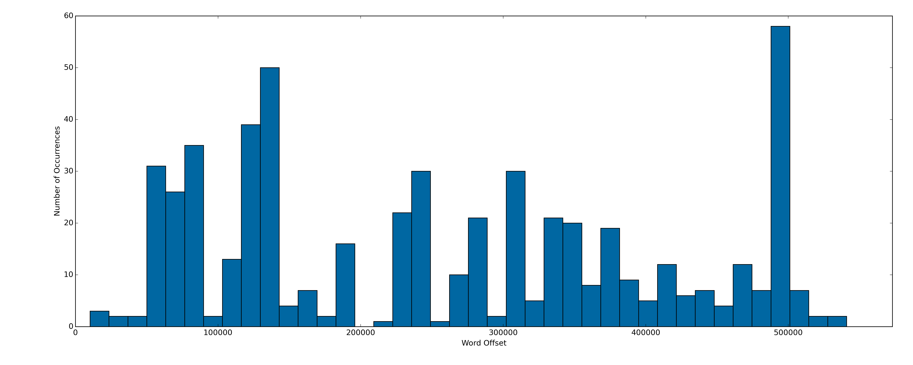
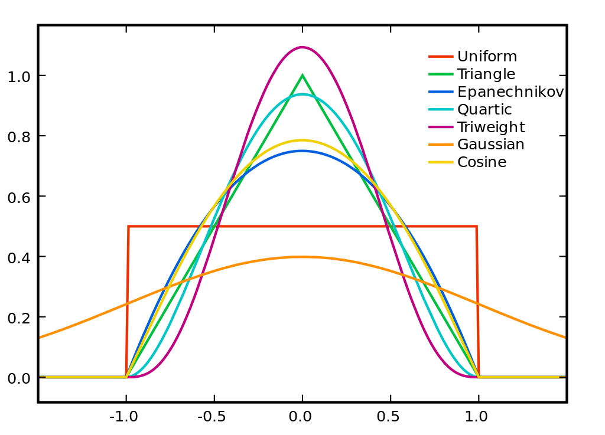

## (Mental) maps of texts with kernel density estimation

Earlier in the summer, I was thinking about the way that words distribute inside of long texts - the way they slosh around, ebb and flow, clump together in some parts but not others. Some words don't really do this at all - they're spaced evenly throughout the document, and their distribution doesn't say much about the overall structure of the text. This is certainly true for stopwords like "the" or "an," but it's also true for words that carry more semantic information but aren't really associated with any particular content matter. For example, think of words like "quickly" or "put" - they're generic terms, free-agents that could be used in almost any context.

Other words, though, have a really strong semantic focus - they occur unevenly, and they tend to hang together with other words that orbit around a shared topic. For example, think of a long novel like _War and Peace_, which contains dozens of different conceptual threads. There are battles, dances, hunts, meals, duels, salons, parlors, and so on and so forth - and, in the broadest sense, the "war" sections and the "peace" sections. Some words are really closely associated with some of these topics but not others. If you open to a random page and see words like "Natasha," "dancing," "family," "marry," or "children," it's a pretty good bet that you're in a peace-y section. But if you see words like "Napoleon," "Borodino," "horse," "fire," "cannon," or "guns," it's probably a war section. Or, at a more granular level, if you see words like "historian" or "clock" or "inevitable," there's a good chance it's one of those pesky historiographic essays.

To borrow Franco Moretti's term, I was looking for a way to "operationalize" these distributions - a standardized way to generate some kind of lightweight, flexible statistic that would capture the structure of the locations of a term inside a document - ideally in a way that would make it easy to compare it with with the locations of other words. I started poking around, and quickly discovered that if you know anything about statistics (I really don't, so take all of this with a grain of salt), there's a really simple and obvious way to do this - a kernel density estimate, which takes a set of data points and works backward to approximate a probabilty density function that, if you sampled it the same number of times, would produce more or less the same set of data.

Kernel density estimation (KDE) is really easy to reason about - unlike the math behind something like topic modeling, which gets complicated pretty fast, KDE is basically just simple arithmetic. Think of the text as a big X-axis, where each integer corresponds to a word position in the text. So, for _War and Peace_, the text would stretch from the origin to the X-axis offset of 573,064, the number of words in the text. Then, any word in the text can be plotted just by laying down ticks on the X-axis at all the offsets where the word shows up in the text. For example, here's "horse" in _War and Peace_:

[fig]

One easy way to start to think about this is to create a simple histogram, which projects the density of the points onto the Y-axis - chop up the X-axis into a set of evenly-spaced bins, and then draw bars up to the values on the Y-axis that represent the number of data points that fall within each segment:



A kernel density estimate is the same idea, except, instead of just counting up the points, each point is represented as a "kernel" function centered around that point. A kernel is just some kind of weighting function that models a decay in intensity around the data point. At the very simplest, it could be something like the uniform kernel, which just converts the point into a rectangular region over the X-axis, but most applications use something smoother, like the Epanechnikov or Gaussian functions. For the purposes of this project, though, they all give basically the same results.



"[Kernels](http://commons.wikimedia.org/wiki/File:Kernels.svg#mediaviewer/File:Kernels.svg)" by Brian Amberg - CC Attribution-Share Alike 3.0 via Wikimedia Commons.

The important thing, though, is that the kernel transforms the point into a _range_ or _interval_ of significance, instead of just a one-dimensional dot. This is cool because it maps well onto basic intuitions about the "scope" of a word in a text. When you come across a word, _where_ exactly does it have significance? Definitely right there, at the exact location where it appears, but not _just_ there - it also makes sense to think of a kind of "relevance" or "meaning energy" that dissipates around the word, slowly at first across the immediately surrounding words and then more quickly as the distance increases. Words aren't self-contained little atoms of information - they radiate meaning forward and backward onto one another. The kernel is a simple way to formalize this "meaning-shape" as it appears to the psychological gaze of the reader.

Anyway, once the all of the kernels are in place, estimating the density function is just a matter of stepping through each position on the X-axis and adding up the values of all the kernel functions at that particular location. This gives a composite curve that captures the overall distributon of the term. Here's "horse" again:

[fig]

This makes it possible to visually confirm the earlier intuitions about the groups of words that tend to hang together in the text. Here's the peace-y cluster from above:

[fig]

And the war-y cluster:

[fig]

And all together, which throws the contours of the two general categories into relief:

[fig]

### "More like this"

These are fun to look at, but the real payoff is that the density estimates make it easy to compute a precise "similarity" score that measures the extent to which any two words appear in the same locations in the text. Since the end result is just a standard-issue probability density function, we can make use of any of the dozens of statistical tests that measure the closenes of two distributions (see this paper for a really good survey of the options). One of the simplest and most computationally efficient methods is just to measure the size of the geometric overlap between the two distributions. for each sample point on the X-axis, take the smaller of the two corresponding Y-axis values in the two distributions. Then, take the discrete integral of the resulting area:

[fig]

Which gives a score between 0 and 1, where 0 would mean that the two words appear in completely different parts of the document, and 1 would mean that the words appear in _exactly_ the same places. So, for example, if you score a word against itself:

[fig]

The result is 1 (or, at least, it would be if we computed a continuous integral), since, tautologically, a word occurs exactly where it does. And, for two words that clump in very different places, the result edges towards 0:

[fig]

Or, when words clump together, the result edges back up towads 1. For example, how similar is "horse" to "cannon"?

[fig]

Which puts "horse" just a bit closer than "shout," which weighs in at 0.XX:

[fig]

This, then, points to a interesting next step - for any given word, you can compute its similarity score with _every other word in the text_, and then sort the results in descending order to create a kind of "more-like-this" list. For example, here are the twenty words that distribute most closely with "horse," all clearly related to some manner of warfare:

```shell
[('horse', 1.0),
 ('rode', 0.7156011202926531),
 ('galloped', 0.67951772827583534),
 ('shouted', 0.6602691076734325),
 ('front', 0.64703726532420802),
 ('stopped', 0.6337873432359088),
 ('riding', 0.62709444946705306),
 ('sound', 0.61458151640388214),
 ('mounted', 0.60996757684494973),
 ('black', 0.5989115268646108),
 ('moved', 0.59016371232198606),
 ('heard', 0.5851426836507474),
 ('order', 0.58257239016777396),
 ('fell', 0.58238137639270227),
 ('officer', 0.58156350144177282),
 ('past', 0.58038248681067495),
 ('back', 0.58000948907079442),
 ('saddle', 0.5722926514329203),
 ('reins', 0.56943413446980706),
 ('running', 0.5650928776822528)]
```

Or, at the other end of the spectrum, "Natasha" sits atop an immeditely-recogniziable stack of words related to family, women, joy, and general peace-y happiness:

```shell
[('natasha', 1.0),
 ('countess', 0.64952743510222721),
 ('love', 0.62780179107755063),
 ('sonya', 0.61116472044961201),
 ('happy', 0.55910563359716869),
 ('mother', 0.55680969150565873),
 ('girl', 0.55248518137847524),
 ('tender', 0.55005081027294156),
 ('mamma', 0.50991428606173173),
 ('room', 0.50679420736877034),
 ('kissed', 0.5065730294175661),
 ('dress', 0.50582810087728014),
 ('family', 0.49937575974145743),
 ('flushed', 0.49724604947295203),
 ('happened', 0.49627846138162601),
 ('sat', 0.48512236990412561),
 ('marry', 0.4766831441500663),
 ('strange', 0.47472691162670833),
 ('breathing', 0.47437113582007573),
 ('jumped', 0.47428160237464612)]
```

By skimming off the strongest links at the top of the stack, you end up with a custom little "distribution topic" for the word, a community of siblings that intuitively hang together. It's sort of like really simple, "intra-document" form of topic modeling.

### Twisty little passages

The really cool thing about this, though, is that it makes it possible to traverse the internal topic structure of the document, instead of just sliding back and forth on the linear axis of words. For example, once you've computed the sibling community for "horse," you can then do the same thing for any of the other words in the stack. If you take the second word, for example - "rode" - and compute _its_ sibling community, you'll see many of the same words again - by a kind of commutative property, words that were similar to "horse" will also be similar to "rode," since "rode" was similar to "horse". But, since the distribution of "rode" is a bit different, other terms will start to creep into view. Each time you do this, the semantic field will shift to center most closely on the anchoring word at the top of the stack. And as you do this again and again, you start to traverse into completely different domains of meaning in the text. The war terms of the "horse" community can be followed into a cluster of terms about the body - no doubt, in the context of the war sections, related to _injury_ - which, in turn, can be used as a bridge to gain access to other body-related words like "face" and "lips," which finally give access to the prototypically peace-y threads in the text - "laugh," "smile," "dance," etc. Each sibling community is like a room in a massive maze, and each of the words is like a door that leads into an adjacent room that occupies a similar but slightly different place in the overall topic-blueprint of the text.

This fascinates me because it _de-linearizes_ the text - which, I think, is truer to the form it takes when it's staged in the mind of a reader. Texts are one-dimensional lines, but - at the risk of generalizing, since this drifts into a subjective phenomenology of reading - we don't really think of texts as lines, or at least not _just_ as lines. We think of them as landscapes, regions, graphs, maps, diagrams, networks - clusters of characters, scenes, ideas, emotional valences, and color palettes, all set in relation to one another and wired up in lots of different ways. The text scrolls by on a one-dimensional track, but we're constantly clipping things out, shuffling them around, and arranging them onto a kind of congnitive pinboard, a mental map of the text as a little dimensional world instead of a linear axis of of words. Notions of "proximity" or "closeness" become divorced from the literal, X-axis positions of things in the document. In _War and Peace_, for example, I think of the battles at Borodino and Austerliz as being very "close" to one another, in the sense that they're the two major military set pieces in the plot. In fact, though, they're actually very "distant" in terms of where they actually appear in the text - they're separated by about 300,000 words, and their density functions only have an overlap of ~0.11, meaning, essentially, that they _don't_ overlap with each other about 90% of the time:

[fig]

So, how to operationalize that "conceptual" closeness? It turns out that this can be captured just by creating a comprehensive network that traces out _all_ of the implicit linkages between the distribution topics, the "rooms" in the textual maze. The basic idea here - converting a text into a network - is an old one. In the past, lots of projects have experimented with representing a text as a social network, a set of relationships between characters to speak to one another or appear together in the same sections of the text. And, just like I'm doing here, lots of projects have looked into different ways of representing all of the terms in a text in a network. In the past, though, most of the techniques have centered around a more traditional notion of "collocation" as the word appears in computational lingustics, which has more to do with words that appear within a very tight window in the text - often literally side-by-side. A really interesting project called TexTexture, for example, devised a method for visualizing the relationships between words that appeared within a 2- or 5-word radius in the document. As I'll show in a moment, though, I think there are some interesting advantages to using the probability density estimates as the underlying statistic that governs how the words are connected in the network - the distributions tease out a kind of architectural "blueprint" of the document, which often maps onto the cognitive experience of the text in interesting ways.

Anyway, once we've laid down all the piping to compute and compare the distribution densities of the words, constructing the actual graph is easy. For each word:

1. Compute the similarity between the word's probability density function and the function of every other word in the text.

1. Sort the list in descending order to get ranked stack of "distribution siblings," words that tend to show up in the same parts of the document.

1. Skim off the strongest links - say, the top 10 - and add them as nodes to a graph, using the similarity score as the weight of the edge that connects them.

Once this is in place, we get access to the whole scientific literature of graph-theoretic concepts, and the conceptual relationship between "austerlitz" and "borodino" falls out really easily - we can use Dijkstra's algorithm to get the shortest path between the two, which, unsurprisingly, makes just a single hop through the word "battle":

`austerlitz -> battle -> borodino`

With a path length of XXX, which puts "austerlitz" closer to "borodino" than about **XX%** of all other words in the text, even though they only co-occur about 10% of the time.

### Mapping the maze

This is useful as a confirmation that the network is capturing something real about the text. But it's sort of like stumbling through one little passage in the labyrinth with a torch, tracing out a single thread of connection in the document. What your really want is to be able to zoom back and see a bird's-eye view of the entire thing at once, to trace out all of the connections between each of the words in the text with all of the other words. This is a perfect task job for any of the off-the-shelf network layout algorithms, which treat all of the nodes as "particles" that repel one another by default, but which are bound together by a set of attractive forces exerted by the edges that connect them. Force Atlas 2 in Gephi works well - _War and Peace_ unfolds into a huge, spindly triangle:

[fig]

War to the left, peace to the right, and history on top, between the two. (Of course, "on top" doesn't have any real meaning, since the orientation is random - I've rotated the final render to make it easy on the eye. What does have meaning, though, is the _relative_ positions of the words, the relationships between the regions - that history is "between" war and peace, etc.) In the process of grouping together the most similarly-distributed words, the layout algorithm also has the effect of spreading apart the most "distant" words, the terms that appear in the most precisely _different_ places in the text - the conceptual extremes, the primitive elements that can't be folded together into something more basic.

This makes it possible to position different elements of text as they relate to the high-level categories. For example, look at the huge amount of of space between "Napoleon" and "Bonaparte," which I would have expected to hang together pretty closely. "Napoleon" sits along the top left shoulder of the triangle, along the gradient between "battle" and "history," in the middle of a section related to military strategy and tactics ("military," "plan," "campaign," "men," "group"). Whereas "Bonaparte" is way down at the bottom of the triangle, almost exactly in the middle of the gradient running between war and peace, just shy of a cluster of words related to the aristocratic salon ("Anna," "Pavlovna," "sitting," "laughing"). The two names enact different roles in the text - "Napoleon" is the man himself, winning battles and participating in the abstract notion of history, and "Bonaparte" is the Russian imagination of the man, a name whispered at parties in Moscow and St. Petersburg. Pierre, meanwhile, shows up near the connection point with the history cluster, surrounded bywords of spiritual anxiety and questing - "doubt," "soul," "time," "world," "live." Anatole is in the furthest reachest of the peace section, right next to "visitors" (he was one) and "daughters" (he eloped with one). Rostov and Andrei (Andrew, in the Garnett translation) are at the bottom center, right near "Bonaparte" in the bridge between war and peace. The women and children, meanwhile, are almost completely confined to the peace cluster - Natasha, Marya, Sonya, Anna, Helene, along with basically all words about or related to women - "lady," "girl," "mother," "countess," "daughter," etc. Women essentially _instantiate_ peace, and have very little interaction with history or war - it's almost as much _War and Women_ as _War and Peace_.

I'm also interested in the gradients that run between the conceptual extremes - the means by which the different sections transmute into one another. For example, look again at the bottom center of the network, near "Bonaparte," right where war crosses over into peace. How is that transition actually accomplished? If you look closely, there's a cluster of terms right between the two related to the body and physical contact - "lips," "hand," "fingers," "touched," "eyes," "face," "shoulders," "arm," "foot," "legs." Which, it seems, are used to describe both the physicality of military life and the niceties of Russian high soceity - the embraces, clasps, arms over shoulders, pats on backs, etc. War becomes peace by way of the _body_, which is subject both to the violence of war and the sensuality of peace. Or, more broadly, look at the left and right sides of the triangle, the gradients running from `peace -> history` on the right and `war -> history` on the left. Both of these are also gradients from concrete to general, specific to abstract. The individual women and children that represent the furthest extreme of the peace corner give way to a cluster of terms about family in general - "children," "wife," "husband," "family" - before rising up into the history cluster by way of "life" and "live." On the right side, terms related to the specifics of battle - "guns," "flank," "line," "borodino," "battle" - give way to Napoleon's cluster of words related to strategy and tactics - "plan," "military," "campaign," "strength," "number" - which then join the history section by way of "direction." It's a big diagram of the _idea_ of the text.

Here's the _Odyssey_:

[fig]

Here, instead of war/peace, it's an opposition between land and sea, home and away. At the bottom are Ithaca, Penelope, the suitors, the world of people, civilization, conflict; at the top, the world of the "raft," the home away from home, the natural world, the physical and metaphorical space between Troy and Ithaca - "waves," "sea," "wind," "island," "cave," "shore," the cyclops, the sirens. Compare this with the architecture of _Walden_, which takes the form of long, narrow pillar of words, which also span a gradient between land/civilization and water/wilderness:

[fig]

The world of Concord is at the bottom - "civilization," "enterprise," "comforts," "luxury," "dollars," "fashion." As you move up, this gives way Thoreau's narrative about his attempt to build his own, simplified version of the this world - "roof," "built," "dwelling," "simple." Which in turn bleeds into the world of his day-to-day existince at Walden, anchored around the word "day" - "hoeing" the field, "planting beans," "singing" to himself, "sitting", "thinking." Then the graph crosses over completely into the world of the pond - "water," "surface," "depth," "waves," and "walden." Remarkably, at the very top of the network, along with "lake" and "shore," is "_boat_," which is eerily similar to the "raft" on top of the _Odyssey_ - the most extreme removal from human civilization, the smallest outpost of habitable space. Both enact the same dialectic - between a world of men on land, and a world of solitude out in the midst of some kind of watery wilderness.

The _Divine Comedy_ looks almost exactly like _Walden_, except Concord/Walden is replaced with hell/heaven, with, fittingly enough, "christ" perched on top of the whole thing:

[fig]

### Null results

This doesn't work nearly as well with texts that don't naturally split up into these kind of cleanly-defined sections. For example, here's _Leaves of Grass_:

[fig]

It's less geometrically differentiated, less intelligible. If you squint at it, there actually is some interesting structure - there are pretty clear regions associated with war and the body, and a big, diffuse shoulder of the network that I'd argue has to do with _time_. America in relation the past in Europe, Whitman as a poet in relation to the past in Europe, Whitman in relation to his future readers, Whitman's vision of an American destiny in the west, etc. (if you buy this, the war/body/time triad starts to look strangely similar to war/peace/history). But it's much more of an exertion - it's more muddled, less immediately legible.

In one way, this probably just reflects something true about _Leaves of Grass_ - it's more finely chopped, more heterogeneous, more evenly mixed than something like _War and Peace_, with its nice, tidy war/peace/history sections. But I think it's also exposing a weakness in the technique. Right now, I pick the words that get included in the network in a really simple (and possibly stupid) way - after removing stopwords, I just take the top X most frequent words in the text, usually 500. The problem with this, I think, is that it includes lots of words that are really evenly distributed - that aren't "typical" of any particular topic. Which, since they're somewhat similar to everything, act like binding agents that lock down the network and keep it from differentiating into a more useful map of the document. I wonder if there might be a more sophisticated way to pick the words that would only select the "clumpiest" ones, for lack of a better word - terms that appear very frequently and also very _unevenly_.

Anyway, I'm really just starting to tinker around with this stuff, and I'm still at the point where I've got more questions than answers. In the long run, I'm actually more interested in _analyzing_ these kinds of networks than _visualizing_ them - boiling out metrics that make it possible to compare large groups of texts in interesting ways. This is where I need to learn more about network theory. Would it be possible to classify the networks in terms of "modularity," the extent to which they cleave into different sections? Or, a way to capture the total "width" of the text, the distance between the most dissimilar words? What about some way to automatically extract the terms at the "poles" that often emerge in the layouts, and then compare the results over large corpora to find texts that deal with the same basic categories? How do the results differ from author to author, period or period, etc.?
