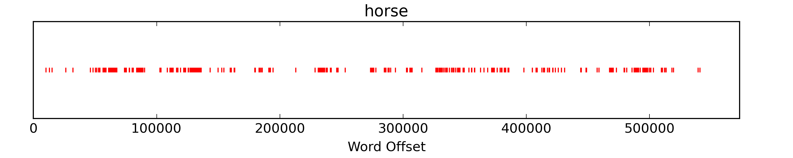
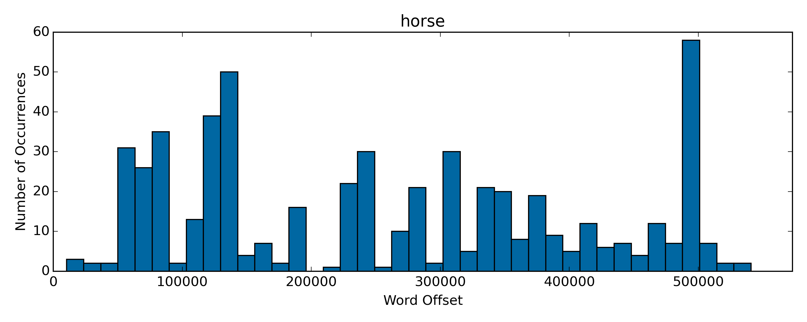
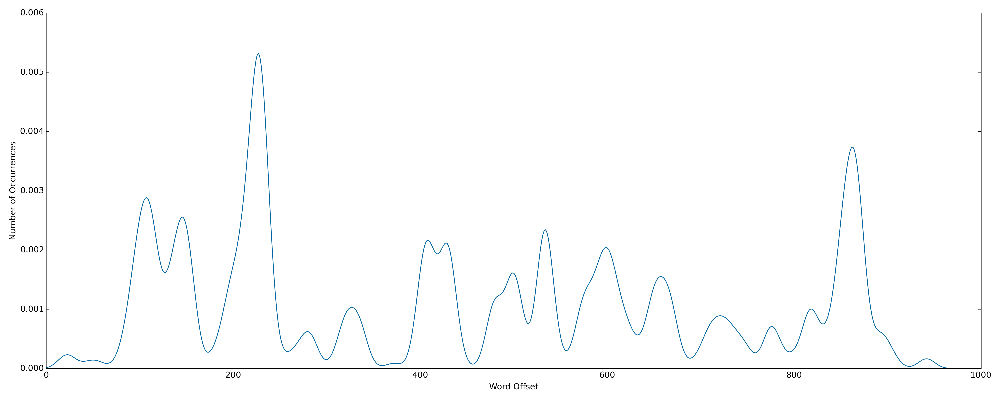
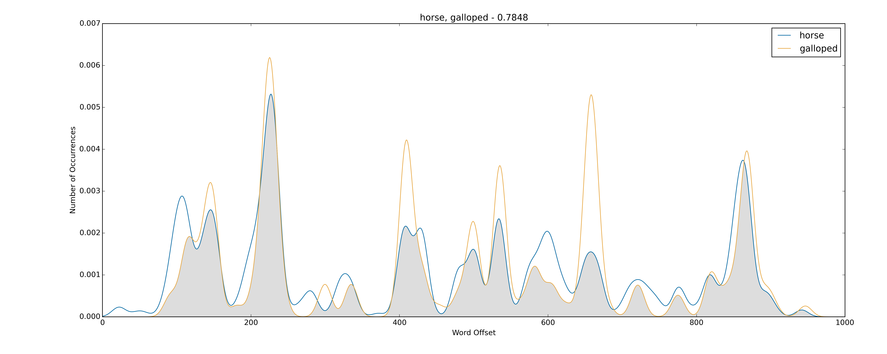
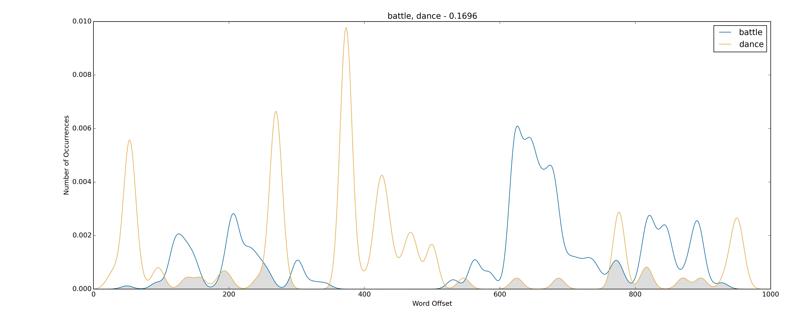

## (Mental) maps of texts with kernel density estimation

Earlier in the summer, I was thinking about the way that words distribute inside of long texts - the way they slosh around, ebb and flow, clump together in some parts but not others. Some words don't really do this at all - they're spaced evenly throughout the document, and their distribution doesn't say much about the overall structure of the text. This is certainly true for stopwords like "the" or "an," but it's also true for words that carry more semantic information but aren't really associated with any particular content matter. For example, think of words like "quickly" or "put" - they're generic terms, free-agents that could be used in almost any context.

Other words, though, have a really strong semantic focus - they occur unevenly, and they tend to hang together with other words that orbit around a shared topic. For example, think of a long novel like _War and Peace_, which contains dozens of different conceptual threads. There are battles, dances, hunts, meals, duels, salons, parlors - and, in the broadest sense, the "war" sections and the "peace" sections. Some words are really closely associated with some of these topics but not others. If you open to a random page and see words like "Natasha," "dancing," "family," "marry," or "children," it's a pretty good bet that you're in a peace-y section. But if you see words like "Napoleon," "Borodino," "horse," "fire," "cannon," or "guns," it's probably a war section. Or, at a more granular level, if you see words like "historian" or "clock" or "inevitable," there's a good chance it's one of those pesky historiographic essays.

To borrow Franco Moretti's term, I was looking for a way to "operationalize" these distributions - some kind of lightweight, flexible statistic that would capture the structure of the locations of a term inside a document, ideally in a way that would make it easy to compare it with with the locations of other words. I started poking around, and quickly discovered that if you know anything about statistics (I really don't, so take all of this with a grain of salt), there's a really simple and obvious way to do this - a kernel density estimate, which takes a collection of observed data points and works backward to approximate a probabilty density function that, if you sampled it the same number of times, would produce more or less the same set of data.

Kernel density estimation (KDE) is really easy to reason about - unlike the math behind something like topic modeling, which gets complicated pretty fast, KDE is basically just simple arithmetic. Think of the text as a big X-axis, where each integer corresponds to a word position in the text. So, for _War and Peace_, the text would stretch from the origin to the X-axis offset of 573,064, the number of words in the text. Then, any word can be plotted just by laying down ticks on the X-axis at each location where the word shows up in the document. For example, here's "horse" in _War and Peace_:



One easy way to start to think about this is to create a simple histogram, which projects the density of the points onto the Y-axis - chop up the X-axis into a set of evenly-spaced bins, and then draw bars up to the values on the Y-axis that represent the number of points that fall within each segment:



A kernel density estimate is the same idea, except, instead of just counting up the points, each point is represented as a "kernel" function centered around that point. A kernel is just some kind of weighting function that models a decay in intensity around the data point. At the very simplest, it could be something like the uniform kernel, which just converts the point into a rectangular region over the X-axis, but most applications use something smoother like the Epanechnikov or Gaussian functions. For the purposes of this project, though, they all give basically the same results.


"[Kernels](http://commons.wikimedia.org/wiki/File:Kernels.svg#mediaviewer/File:Kernels.svg)" by Brian Amberg - CC Attribution-Share Alike 3.0 via Wikimedia Commons.

The important thing, though, is that the kernel transforms the point into a _range_ or _interval_ of significance, instead of just a one-dimensional dot. This is nice because it maps well onto basic intuitions about the "scope" of a word in a text. When you come across a word, _where_ exactly does it have significance? Definitely right there, where it appears, but not _just_ there - it also makes sense to think of a kind of "relevance" or "meaning energy" that dissipates around the word, slowly at first across the immediately surrounding words and then more quickly as the distance increases. Words aren't self-contained little atoms of information - they radiate meaning forward and backward onto one another. As you slide your eyes across the text, each word carries a kind of psychological energy that spikes highest at the moment that you actually encounter it. But that energy doesn't instantly materialize and then vanish - the word casts a shadow of meaning onto the words that follow it, and also exerts an energy backwards in memory on the words that came before it. The kernel is a simple way to formalize this "meaning-shape" as it appears to the psychological gaze of the reader.

Anyway, once the all of the kernels are in place, estimating the density function is just a matter of stepping through each position on the X-axis and adding up the values of all the kernel functions at that particular location. This gives a composite curve that captures the overall distributon of the term. Here's "horse" again:



This makes it possible to visually confirm the earlier intuitions about the groups of words that tend to hang together in the text. Here's the peace-y cluster from above:

[fig]

And the war-y cluster:

[fig]

And all together, which throws the contours of the two general categories into relief:

[fig]

### "More like this"

These are fun to look at, but the real payoff is that the density estimates make it easy to compute a really precise, fine-grained similarity score that measures the extent to which any two words appear in the same locations in the text. Since the end result is just a regular probability density function, we can make use of any of the dozens of statistical tests that measure the closenes of two distributions (see [this paper](http://csis.pace.edu/ctappert/dps/d861-12/session4-p2.pdf) for a really good survey of the options). One of the simplest and most efficient ways to do this is just to measure the size of the geometric overlap between the two distributions. This gives a score between 0 and 1, where 0 would mean that the two words appear in completely different parts of the text, and 1 would mean that the words appear in _exactly_ the same places (ie, they're the same word). For example, how similar is "horse" to "rode"?


Very close - their density functions have about an 80% overlap, which puts "rode" just a bit closer than "galloped," which weighs in at ~0.78:



Or, at the opposite end of the spectrum, words that show up in very different parts of the document will have much less overlap, and the score will edge towards 0:



This, then, points to a interesting next step - for any given word, you can compute its similarity score with _every other word in the text_, and then sort the results in descending order to create a kind of "more-like-this" list. For example, here are the twenty words that distribute most closely with "Napoleon," all clearly related to war, conquest, power, etc:

```bash
[('napoleon', 1.0),
 ('war', 0.65319871313854128),
 ('military', 0.64782349297012154),
 ('men', 0.63958189887106576),
 ('order', 0.63636730075877446),
 ('general', 0.62621616907584432),
 ('russia', 0.62233286026418089),
 ('king', 0.61854160459241103),
 ('single', 0.61630514751638699),
 ('killed', 0.61262010905310182),
 ('peace', 0.60775702746632576),
 ('contrary', 0.60750138486684579),
 ('number', 0.59936009740377516),
 ('accompanied', 0.59748552019874168),
 ('clear', 0.59661288775164523),
 ('force', 0.59657370362505935),
 ('army', 0.59584331507492383),
 ('authority', 0.59523854206807647),
 ('troops', 0.59293965397478188),
 ('russian', 0.59077308177196441)]
```

Or, at the other end of the spectrum, "Natasha" sits atop a stack of very Natasha-esque words related to family, emotion, youth, and general peace-time happiness (with the exception of "sad," which, presumably, is the unhappy endings with Anatole and Andrei):

```bash
[('natasha', 1.0),
 ('sonya', 0.70886263341693823),
 ('countess', 0.69992603393549424),
 ('mother', 0.69396076158543107),
 ('love', 0.69394361206264776),
 ('tender', 0.69022062349028213),
 ('family', 0.63830887117531232),
 ('marry', 0.63600169904982695),
 ('secret', 0.6352113995040839),
 ('happy', 0.63179263139217623),
 ('girl', 0.62577947223072128),
 ('flushed', 0.61694787819224595),
 ('rapturous', 0.61229277139972438),
 ('sad', 0.6121299034400407),
 ('happened', 0.60853750169005538),
 ('invited', 0.60431370654414285),
 ('parents', 0.60292426299430668),
 ('jumped', 0.59803596295531403),
 ('realized', 0.59801227498210729),
 ('lady', 0.596816756054939)]
```

By skimming off the strongest links at the top of the stack, you end up with a custom little "distribution topic" for the word, a community of siblings that intuitively hang together. It's sort of like really simple, "intra-document" form of topic modeling.

### Twisty little passages

The really cool thing about this, though, is that it makes it possible to traverse the internal topic structure of the document, instead of just sliding back and forth on the linear axis of words. For example, once you've computed the sibling community for "napoleon," you can then do the same thing for any of the other words in the stack. If you take the second word, for example - "war" - and compute _its_ sibling community, you'll see many of the same words again - by a kind of commutative property, words that were similar to "napoleon" will also be similar to "war," since "war" was similar to "napoleon". But, since the distribution of "war" is a bit different, other terms will start to creep into view. Each time you do this, the semantic field will shift to center most closely on the anchoring word at the top of the stack. And, as you do this again and again, you start to traverse into completely different domains of meaning. The terms related to family under the "Natasha" topic - "mother," "marry," "love," "family" - can be followed into a more abstract cluster of words related to people in general - "relations," "act," "person," "people." Which, then, bleeds into Tolstoy's theory of history, which largely takes the form of _military_ history, which makes the hop over into the words about war - "military," "men," "general," and, of course, "napoleon." Each sibling community is like a room in a massive maze, and each of the words is like a door that leads into an adjacent room that occupies a similar but slightly different place in the overall organization of the document.

This fascinates me because it _de-linearizes_ the text - which, I think, is closer to the form it takes when it's staged in the mind of a reader. Texts are one-dimensional lines, but - at the risk of generalizing, since this drifts into a subjective phenomenology of reading - we don't really think of texts as lines, or at least not _just_ as lines. We think of them as landscapes, regions, graphs, maps, diagrams, networks - clusters of characters, scenes, ideas, emotional valences, and color palettes, all set in relation to one another and wired up in lots of different ways. The text scrolls by on a one-dimensional track, but we're constantly clipping things out, shuffling them around, and arranging them onto a kind of congnitive pinboard, a mental map of the text as a little dimensional world instead of a linear axis of of words. Notions of "proximity" or "closeness" become divorced from the literal, X-axis positions of things in the document. In _War and Peace_, for example, I think of the battles at Borodino and Austerliz as being very "close" to one another, in the sense that they're the two major military set pieces in the plot. In fact, though, they're actually very "distant" in terms of where they actually appear in the text - they're separated by about 300,000 words, and their density functions only have an overlap of ~0.32, meaning, essentially, that they _don't_ overlap with each other about 70% of the time:


So, how to operationalize that "conceptual" closeness? It turns out that this can be captured really easily just by computing the distribution topics for every single word in the text, and then shoveling the strongest connections for each word into a big, comprehensive network that traces out all of the connections between all of the words at once. The basic idea here - converting a text into a network - is an old one. In the past, lots of projects have experimented with representing a text as a social network, a set of relationships between characters to speak to one another or appear in the same sections of the text. And, like I'm doing here, lots of projects have looked into different ways of representing all of the terms in a text. In the past, though, most of the approaches have centered around a more traditional notion of "collocation" as the word appears in computational lingustics, which has more to do with words that appear within a fairly narrow window in the text - often literally side-by-side. A really interesting project called TexTexture, for example, devised a method for visualizing the relationships between words that appeared within a 2- or 5-word radius in the document. As I'll show in a moment, though, I think there are some interesting advantages to using the probability densities as the underlying statistic to determine how the words are connected in the network - the distributions tease out a kind of architectural "blueprint" of the document, which often maps onto the cognitive experience of the text in interesting ways.

Anyway, once we've laid down all the piping to compute and compare the distribution densities of the words, constructing the actual graph is easy. For each word:

1. Compute the distribution similarity between the word and every other word in the text.

1. Sort the list in descending order to get ranked stack of "distribution siblings," words that tend to show up in the same parts of the document.

1. Skim off the strongest links - say, the top 10 - and add them as nodes to a graph, using the similarity score as the weight of the edge that connects them.

Once this is in place, we get access to the whole scientific literature of graph-theoretic concepts, and the conceptual relationship between "austerlitz" and "borodino" falls out really easily - we can use Dijkstra's algorithm to get the shortest path between the two, which, unsurprisingly, makes just a single hop through the word "battle":

`austerlitz -> battle -> borodino`

With a path length of ~`1.12`, which puts "borodino" as the 17th closest word to "austerlitz" out of the 1000 most frequent words in the text, closer than **98%** of the list, even though they only co-occur about 30% of the time:

```bash
[('austerlitz', 0),
 ('campaign', 0.65615563830253976),
 ('military', 0.66679539911035457),
 ('success', 0.67787007836939139),
 ('proposed', 0.67865808794484395),
 ('general', 0.68398944996815592),
 ('emperor', 0.68560221976349289),
 ('suggested', 0.68648086875769576),
 ('battle', 0.68844748754808149),
 ('war', 0.6976220338260869),
 ('kutuzov', 0.70172001357385272),
 ('men', 1.0728368565805544),
 ('army', 1.0815712054823732),
 ('russian', 1.1133724933839888),
 ('commander', 1.1138451527645024),
 ('sovereign', 1.1151396260899902),
 ('french', 1.1172586830800189),
 ('borodino', 1.1183098845396797), <---
 ('chief', 1.1219820113396164),
 ('day', 1.1225800115684308)]
```

### Mapping the maze

This is useful as a confirmation that the network is capturing something real about the text. But it's sort of like stumbling through one little passage in the labyrinth with a torch, tracing out a single thread of connection in the document. What you really want is to be able to zoom back and see a bird's-eye view of the entire thing at once, to wrap your head around the complete set of relations that bind all of the words together. This is a perfect task job for any of the off-the-shelf network layout algorithms, which treat all of the nodes as "particles" that repel one another by default, but which are bound together by a set of attractive forces exerted by the edges that connect them. Force Atlas 2 in Gephi works well - _War and Peace_ unfolds into a huge, spindly triangle:

[fig]

War to the left, peace to the right, and history on top, between the two. Of course, the "on top" has no meaning in and of itself, since the orientation of the layout is random - here and elsewhere, I've rotated the final render to make it easy on the eyes. What does have meaning, though, is the _relative_ position of the words, the relationships between the regions - that history is "between" war and peace, in this case.

This makes it possible to position different elements of text as they relate to the high-level categories - kind of like a big, nerdy, literary "where's Waldo?" This can lead to some interesting insights, though - things that I'm not sure that I would have come up with on my own. For example, look at the huge amount of of space between "Napoleon" and "Bonaparte," which I would have expected to hang together pretty closely. "Napoleon" sits along the top left shoulder of the triangle, along the gradient between "battle" and "history," in the middle of a section related to military strategy and tactics ("military," "plan," "campaign," "men," "group"). Whereas "Bonaparte" is way down at the bottom of the triangle, almost exactly in the middle of the gradient running between war and peace, just shy of a cluster of words related to the aristocratic salon ("Anna," "Pavlovna," "sitting," "laughing"). The two names enact different roles in the text - "Napoleon" is the man himself, winning battles and participating in the abstract notion of history, and "Bonaparte" is the Russian imagination of the man, a name whispered at parties in Moscow and St. Petersburg. Pierre, meanwhile, shows up near the connection point with the history cluster, surrounded bywords of spiritual anxiety and questing - "doubt," "soul," "time," "world," "live." Anatole is in the furthest reachest of the peace section, right next to "visitors" (he was one) and "daughters" (he eloped with one). Rostov and Andrei (Andrew, in the Garnett translation) are at the bottom center, right near "Bonaparte" in the bridge between war and peace. The women and children, meanwhile, are almost completely confined to the peace cluster - Natasha, Marya, Sonya, Anna, Helene, along with basically all words about or related to women - "lady," "girl," "mother," "countess," "daughter," etc. Women essentially _instantiate_ peace, and have very little interaction with history or war - it's almost as much _War and Women_ as _War and Peace_.

Also, take a look at the gradients that run between the conceptual extremes - the means by which the different sections transmute into one another. For example, look again at the bottom center of the network, near "Bonaparte," right where war crosses over into peace. How is that transition actually accomplished? If you look closely, there's a cluster of terms right between the two related to the body and physical contact - "lips," "hand," "fingers," "touched," "eyes," "face," "shoulders," "arm," "foot," "legs." Which, it seems, are used to describe both the physicality of military life and the niceties of Russian high soceity - the embraces, clasps, arms over shoulders, pats on backs, etc. War becomes peace by way of the _body_, which is subject both to the violence of war and the sensuality of peace. Or, more broadly, look at the left and right sides of the triangle, the gradients running from `peace -> history` on the right and `war -> history` on the left. Both of these are also gradients from concrete to general, specific to abstract. The individual women and children that represent the furthest extreme of the peace corner give way to a cluster of terms about family in general - "children," "wife," "husband," "family" - before rising up into the history cluster by way of "life" and "live." On the right side, terms related to the specifics of battle - "guns," "flank," "line," "borodino," "battle" - give way to Napoleon's cluster of words related to strategy and tactics - "plan," "military," "campaign," "strength," "number" - which then join the history section by way of "direction." It's a big diagram of the _idea_ of the text.

Here's the _Odyssey_:

[fig]

Here, instead of war/peace, it's an opposition between land and sea, home and away. At the bottom are Ithaca, Penelope, the suitors, the world of people, civilization, conflict; at the top, the world of the "raft," the home away from home, the natural world, the physical and metaphorical space between Troy and Ithaca - "waves," "sea," "wind," "island," "cave," "shore," the cyclops, the sirens. Compare this with the architecture of _Walden_, which takes the form of long, narrow pillar of words, which also span a gradient between land/civilization and water/wilderness:

[fig]

The world of Concord is at the bottom - "civilization," "enterprise," "comforts," "luxury," "dollars," "fashion." As you move up, this gives way Thoreau's narrative about his attempt to build his own, simplified version of the this world - "roof," "built," "dwelling," "simple." Which in turn bleeds into the world of his day-to-day existince at Walden, anchored around the word "day" - "hoeing" the field, "planting beans," "singing" to himself, "sitting", "thinking." Then the graph crosses over completely into the world of the pond - "water," "surface," "depth," "waves," and "walden." Remarkably, at the very top of the network, along with "lake" and "shore," is "_boat_," which is eerily similar to the "raft" on top of the _Odyssey_ - the most extreme removal from human civilization, the smallest outpost of habitable space. Both enact the same dialectic - between a world of men on land, and a world of solitude out in the midst of some kind of watery wilderness.

The _Divine Comedy_ looks almost exactly like _Walden_, except Concord/Walden is replaced with hell/heaven, with, fittingly enough, "christ" perched on top of the whole thing:

[fig]

Shakespeare's _The Winter's Tale_ unwinds into a big, crisply-differentiated stack that runs from the insane jealousy of Leontes in Sicily at the bottom ("tyrant," "accusation," "traitor") to the pastoral joy of Perdita's life in Bohemia:

[fig]

_Moby Dick_ is roughly a big square - Nantucket and the world of land on the bottom ("room," "bed," "house," "landlord," "island"), Ahab and Starbuck to the right, the history of whaling on the left (whales in the abstract), and the hunting of whales at the top (whales in the flesh). Amusingly, it kind of looks like a big whale:

[fig]

It's kind of like reading literary x-rays (hopefully not tea leaves). Here's _Notes from Underground_, which, like the text, splits along the center into two sections - the existentialist rant of "Underground" on the left, the adventures with Zverkov and Liza from "Apropos of the Wet Snow" on the right:

[fig]

Here's the _Origin of Species_, which I've only read in small parts. But, it's actually interesting to do this with a text that you _don't_ know, and see what you can infer about the organization of the document. _Origin of Species_ gives a lot of structure to chew on:

[fig]

### Failures, null results

This big weakness with this, of course, is that it doesn't work nearly as well with texts that don't naturally split up into these kinds of cleanly-defined sections. For example, take a look at _Leaves of Grass_:

[fig]

It's more scrambled, less differentiated, less obviously "accurate" than the tidy triangle of _War and Peace_ or the cosmological pillar of the _Divine Comedy_. If you squint at it for a few minutes, it starts to assemble into some recognizable constellations of meaning, but it's much more of an interpretive exertion to make a case for how the lines should be drawn. Two regions of meaning are fairly clear - on top, a section about war ("soldiers," "battle," "camp," "armies," "war"), and, at the bottom left, a big, diffuse shoulder of the network related to the body, sensuality, sexuality - "neck," "fingers," "limbs," "flesh," "kiss," "touch," "hand," "happy." The right side of the network doesn't hold together as well, but, if this post weren't already much too long, I'd argue that lots of things on the right side converge on a shared preoccupation about _time_ - "eidolons," from the inscription of the same name about how the actions and accomplishments of people are ground into shadows over time; "pioneers," from "Pioneers! O Pioneers," one of the triumphalist narratives about the inevitability of American expansion in the west; and a cluster of terms related to geopolitics and deep time - "universe," "nation," "modern," "centuries," "globe," "liberty," "kings," "America," "mighty." This is Whitman looking back at Europe and forward to what he sees as an American future, both in a political and cultural sense but also in terms of his own relationship, as a poet, to literary and intellectual tradition. It's Whitman thinking about how things change over time. (If you buy this, the war/body/time triad starts to look interestingly similar to war/peace/history).

But, this is much more of a stretch - it's muddled, less legible. In one way, this probably just reflects something true about _Leaves of Grass_ - it's more finely chopped, more heterogeneous, more evenly mixed than something like _War and Peace_. But I think this is also exposing a weakness in the technique - my intuition is that there are, actually, some really distinct topic clusters that should be surfaced out of _Leaves of Grass_, and I wonder if they're getting buried by the simple (and possibly naive) way that I'm picking the words that get included in the network. Right now, I just take the top X most frequent words (excluding stopwords), and compute the relations among just those words. The problem with this, I think, is that it doesn't do anything to filter out words that are very evenly distributed - words that aren't "typical" of any particular topic. Which, since they're similar to everything, act like binding agents that lock down the network and prevent it from differentiating into a more useful map of the document. I wonder if there might be a more sophisticated way to pick the words that would only select the most "clumpy" ones, for lack of a better word - terms that appear very frequenly but also very _unevenly_.

Anyway, I'm really just starting to tinker with this stuff, and I'm still at the point where I've got more questions than answers. More to come.
